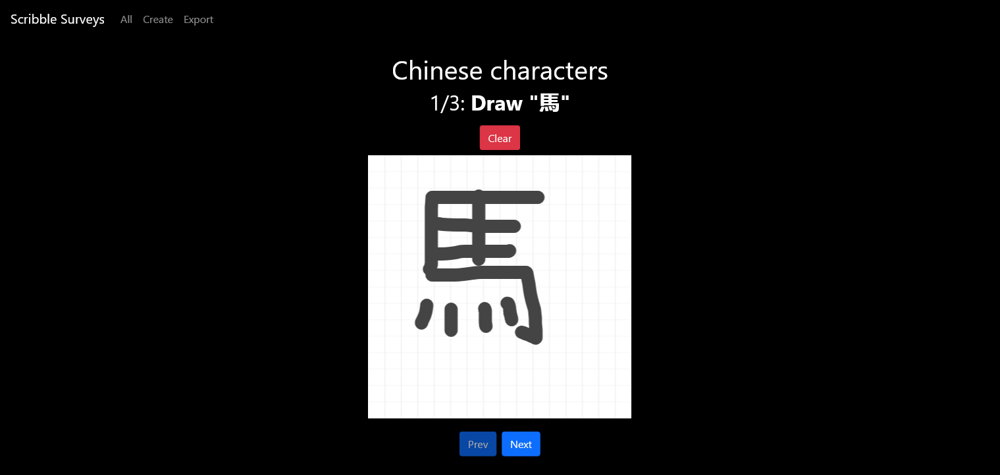

# Scribble Surveys

Web app for collecting drawings

## Getting Started

Create `.env` and `web/.env` from `sample.env` and `web/sample.env` respectively and fill
with proper credentials.

Build everything with:

    make

Or build separately with:

    # App
    make build-app

    # Frontend
    make build-web